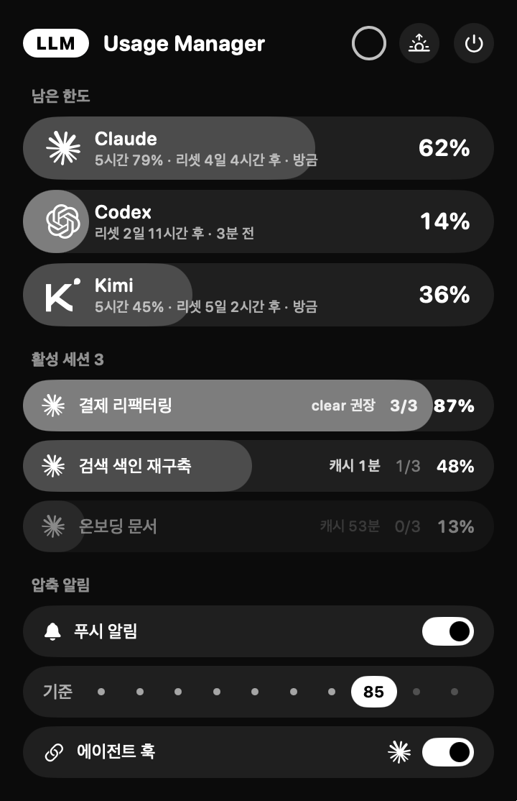

<div align="center">

# Usage Manager

**구독형 코딩 에이전트의 남은 한도와 세션 컨텍스트를 메뉴바에서 본다.**

로그인 없이, 로컬 파일만 읽어서.



</div>

---

## 왜 만들었나

여러 LLM 구독을 동시에 쓰면 두 가지를 계속 놓친다.

**얼마나 남았는지 모른다.** Claude는 Claude 앱에서, Codex는 Codex에서, Kimi는 또 다른 곳에서 확인해야 한다. 한도가 갑자기 막혀야 알아차린다.

**컨텍스트가 언제 꽉 차는지 모른다.** 여러 세션을 병렬로 돌리면 어느 세션이 압축 직전인지 알 수 없다. 자동 압축이 먼저 오면 맥락이 날아간다.

Usage Manager는 이 둘을 한 화면에 올린다. 메뉴바 아이콘 하나, 팝오버 하나.

## 무엇을 보여주나

### 남은 한도

설치된 구독을 자동으로 찾아 **남은 양**을 게이지로 보여준다. 바는 주가 지날수록 줄어들고, 비어 갈수록 경고다. 20% 아래로 떨어지면 행 전체가 밝아진다.

주간 한도가 주된 눈금이고, 제공되는 경우 5시간 한도와 리셋까지 남은 시간이 함께 붙는다. 그 옆에 이 숫자가 언제 것인지도 적는다(`방금` / `n분 전` / `n시간 전`). 한 시간이 넘으면 행이 흐려진다. 숫자만 보고 최신이라 믿는 일이 없도록.

머리말 오른쪽 링은 다음 자동 조회까지 줄어든다. 누르면 그 자리에서 조회한다. 1분에 한 번까지이고, 이미 조회 제한에 걸린 곳은 건너뛰므로 눌러서 제한이 길어지지는 않는다. 제한 중에는 링이 그 사실과 남은 시간을 알려 준다.

### 활성 세션

최근 15분 안에 기록이 있는 **Claude Code 세션**을 컨텍스트 점유율과 함께 나열한다. 3분 이상 조용한 세션은 흐려진다. Codex는 주간 한도만 보여 준다. 그 스레드에는 알림을 넣지 않고 이름도 기록에서 되찾을 수 없어, 보기만 할 뿐 손쓸 수 없는 줄이 되기 때문이다.

이름은 데스크톱 앱에 보이는 그대로 쓴다. 앱이 세션마다 남기는 메타데이터에서 읽기 때문이다. 터미널에서 연 세션은 대화 기록에 적힌 이름을, 그것도 없으면 프로젝트 폴더명을 쓴다.

세션을 clear 하면 새 기록이 시작되고 앱의 메타데이터가 그쪽을 가리킨다. 옛 기록은 파일로 남아 잠시 최근 목록에 걸리는데, 어느 세션의 것도 아니게 된 기록은 목록에서 빼므로 한 세션이 두 줄로 보이지 않는다. 압축 횟수도 새 기록 기준으로 0부터 다시 센다.

그 옆에 **압축을 몇 번 거쳤는지**가 `1/3` 꼴로 붙는다. 뒤의 숫자는 "몇 번 압축하면 새 세션으로 옮길지"에 대한 각자의 기준이고, 기준에 닿으면 숫자가 진해진다. 세션 이름 끝에 손으로 적어 둔 `(0/3)` 같은 표기는 표시에서만 떼어 내며, 세션 이름 자체는 건드리지 않는다.

기준에 닿으면 **clear 권장**이 함께 붙고, 알림이 한 번 온다. 압축을 거듭해도 되찾는 공간은 거의 늘지 않는 반면 요약의 요약이 쌓여 정확도만 떨어지기 때문이다(1M 세션 압축 142건 집계: 첫 압축 뒤 남는 양이 31,233 토큰, 다섯 번째 뒤가 39,891 토큰. 그동안 매번 94만 토큰가량이 3만 토큰 요약으로 바뀐다). 횟수가 기준에 닿기 전이라도 직전 요약이 45,000 토큰을 넘으면 같은 권고가 뜬다.

앱은 권하기만 하고 아무것도 지우지 않는다. 직전 압축이 핸드오버를 저장한 뒤에 일어났다면 "clear 권장", 저장 없이 일어났다면 "저장 먼저", 어느 쪽인지 기록이 없으면 "저장 확인"으로 갈린다.

압축 횟수는 대화 기록에 한 줄씩 남는 압축 경계를 세어 얻는다. 기록은 압축되어도 잘리지 않고 계속 이어 쓰이므로, 파일마다 어디까지 셌는지 기억해 두고 새로 늘어난 부분만 읽는다. Codex는 압축을 기록하지 않아 이 숫자가 붙지 않는다.

배경에서 도는 작업(`claude -p`, 서브에이전트)은 사람이 지켜보는 세션이 아니므로 목록에서 뺀다.

### 압축 알림

세션이 기준선을 넘으면 두 곳으로 알린다.

- **사람에게** — macOS 알림
- **에이전트에게** — 그 세션의 다음 프롬프트나 도구 호출에 알림이 끼어든다

두 번째가 핵심이다. 긴 자율 작업 중에는 사용자가 메시지를 보내지 않으므로, 프롬프트만 기다리면 알림이 영영 닿지 않고 자동 압축이 먼저 온다. 도구 호출에도 걸어 두면 에이전트가 작업 도중에 받아서 스스로 마무리 절차를 밟을 수 있다.

기준선은 50~95% 사이에서 고르고 설정은 유지된다. 세션마다 한 번만 울리고, 압축으로 여유가 생기면 다시 무장한다.

### 압축 보류

알림만으로는 늦을 수 있다. 도구를 한 번에 여러 개 부르면 한 응답에 3만 토큰이 늘기도 해서, 앱이 세션의 크기를 알아차린 순간에는 압축이 이미 시작된 뒤다.

그래서 압축을 실제로 붙잡는 것은 알림이 아니라 **압축 직전에 끼어드는 훅**이다. 그 훅이 불렸다는 사실 자체가 이 세션이 압축 지점에 닿았다는 뜻이므로, 앱이 미리 판단해 둘 필요가 없다. 훅은 그 자리에서 핸드오버를 요구하며 압축을 미루고, 에이전트가 저장을 마쳤다고 표시하면 곧바로 통과시킨다.

붙잡는 시간은 알림이 에이전트에게 닿은 순간부터 10분까지다. 그 안에 끝나지 않으면 창이 가득 차는 쪽이 더 위험하므로 압축을 진행시킨다.

붙잡지 않는 경우도 분명히 정해 두었다. 판단을 그르쳐 세션을 묶어 두는 쪽이 압축 한 번을 놓치는 것보다 나쁘기 때문이다.

- **세션이 한도 자체에 닿았을 때.** 그때 일어나는 것은 압축이 아니라 오류이고, 오류 뒤에 따라오는 복구용 압축까지 막으면 세션이 그 자리에 멈춘다. 다음 요청의 크기는 아직 보내지 않은 것이므로, 이미 쌓여 있는 도구 결과까지 세어 미리 가늠한다.
- **크기를 잴 수 없을 때.** 기록을 8MB까지 거슬러 봐도 토큰 수를 못 찾으면 그냥 통과시킨다.
- **서브에이전트의 압축일 때.** 서브에이전트는 부모의 세션 번호를 쓰므로, 여기서 붙잡으면 정작 부모가 압축될 때 쓸 몫을 먼저 써 버린다.

앱이 꺼져 있어도 동작한다. 판단에 필요한 것은 그 순간의 대화 기록뿐이다.

## 데이터는 어디서 오나

**계정 로그인도, 키 입력도, 재인증 팝업도 없다.** 이미 이 맥에서 돌고 있는 것들이 남긴 흔적만 읽는다.

| 항목 | 출처 |
|---|---|
| 한도 | 로컬 프록시가 집계해 둔 값, 그리고 Claude Code가 이미 가지고 있는 자격으로 한 번 조회 |
| Claude 컨텍스트 | 트랜스크립트 끝부분의 토큰 합 ÷ 컨텍스트 창 |
| Codex 한도 | rollout 로그에 기록된 값, 그리고 로컬 프록시 |

Claude 한도는 Claude Code가 최신으로 유지하는 keychain 항목을 읽어 조회한다. 유효한 동안(최대 한 시간) 메모리에 두고 거절당하면 그 자리에서 버리므로, 조회할 때마다 keychain을 다시 열지 않는다. 읽을 때마다 로그에 한 줄이 남는데 남는 것은 지문뿐이고 값은 기록하지 않는다. 요청은 `claude-code/<설치된 버전>`으로 자신을 밝힌다. 이 엔드포인트가 낯선 호출자에게 더 엄한 제한을 걸기 때문이다.

읽기 전용이다. 자격을 갱신하거나 저장하거나 기록하지 않으므로 기존 로그인 상태를 건드리지 않는다. LLM을 호출하지 않으니 **토큰을 한 개도 쓰지 않고 한도도 깎이지 않는다.**

창 크기는 추정하지 않는다. Codex는 로그에 창 크기가 직접 박혀 있어 그대로 쓴다(GPT 계열 258,400 / Kimi 996,147 — 실측). Claude는 자동 압축이 일어난 지점 90건을 역산해 확인했다.

## 가볍다

- CPU **1% 안팎** (3분씩 네 번 실측 0.28 / 0.78 / 1.19 / 1.43% — 추적 중인 세션이 바쁠수록 올라간다), 메모리 **약 95MB**
- 메모리는 대부분 SwiftUI 런타임 몫이다. 세션이 하나도 없는 홈에서도 68MB다
- 데스크톱 앱의 세션 메타데이터를 읽느라 그 위로 10MB 남짓이 더 붙는다. 파일 하나가 500KB에 이르고 수백 개인데, 필요한 건 네 필드뿐이라 통째로 해석하지 않고 바이트에서 뽑아내며 파일은 복사 대신 매핑해서 본다(그렇게 바꾸기 전에는 118MB였다)
- 실행 직후 몇 분은 이보다 높다. 그때 전체를 한 번 훑기 때문이고, 그 뒤로는 바뀐 파일만 다시 읽는다
- 파일 변경을 FSEvents로 감지해 **바뀐 파일만** 다시 읽는다
- 각 로그는 끝 256KB만 본다. 크기가 그대로면 다시 파싱하지 않는다
- 전체 훑기는 실행 직후와 10분에 한 번뿐

순수 Swift, 외부 의존성 없음.

## 설치

[**Releases**](../../releases/latest)에서 맥에 맞는 DMG를 받는다.

| 맥 | 파일 |
|---|---|
| Apple Silicon (M1~) | `UsageManager-x.y-apple-silicon.dmg` |
| Intel | `UsageManager-x.y-intel.dmg` |

열어서 `Usage Manager`를 Applications로 끌어 놓는다. macOS 14 이상.

> 서명은 되어 있지만 공증은 받지 않았다. 처음 열 때 경고가 뜨면 앱을 **우클릭 → 열기**를 한 번 하거나:
> ```bash
> xattr -dr com.apple.quarantine "/Applications/Usage Manager.app"
> ```

## 에이전트 훅 연결

팝오버의 **에이전트 훅** 스위치를 켜면 Claude Code(`~/.claude/settings.json`)에 세 가지가 등록된다. 주간 한도를 모으는 statusLine, 알림을 건네는 프롬프트·도구 호출 훅, 그리고 압축을 붙잡는 훅이다. 기존 설정은 그대로 두고 필요한 항목만 더하며, 수정 전 원본을 `*.usage-manager.bak`으로 백업한다. 스위치를 끄면 되돌린다.

Codex에는 설치하지 않는다. Codex는 자체 압축을 기록으로 남기지 않아 붙잡을 것이 없고, 그 프롬프트에 넣던 알림도 뒤를 받쳐 줄 것이 없었다. 예전 버전이 넣어 둔 항목이 있으면 스위치를 켜거나 끌 때 함께 빼낸다. Codex 세션은 목록에도 그대로 나오고 한도도 계속 읽는다.

처음 한도를 조회할 때 keychain 접근을 한 번 승인해야 한다. **"항상 허용"**을 눌러 두면 된다.

배포본은 ad-hoc 서명이라 업데이트할 때 다시 물을 수 있다. 서명이 바뀌면 macOS가 다른 앱으로 보기 때문이다. 이 맥에서 직접 빌드한다면 그럴 일이 없다. `scripts/make_app.sh`가 코드 서명 인증서를 찾아 그것으로 서명하므로, 승인이 코드 해시가 아니라 인증서에 묶여 업데이트를 넘어 유지된다(`UM_SIGN_ID`로 인증서를 지정할 수도 있다).

## 직접 빌드

```bash
swift build -c release            # 빌드
scripts/make_release.sh           # dist/ 에 DMG 2종
scripts/check_hooks.sh            # 자체검사 (임시 홈에서 훅 설치·전달·복원)
.build/debug/UsageManager --dump  # 읽어 들인 한도·세션·훅 상태 출력
.build/debug/UsageManager --arm-check  # 예고 알림이 압축 지점보다 먼저 나가는지 확인
.build/debug/UsageManager --scan-replay  # 기록이 자라는 동안 압축 횟수를 제대로 세는지
```

`--dump`는 앱이 실제로 무엇을 읽었는지 그대로 보여준다. 화면과 다르면 여기서부터 확인하면 된다.

## 릴리즈 전 점검

1. `scripts/check_hooks.sh` 통과
2. 설치본에서 실제 동작 확인 — 화면은 `--snap`, 판단은 `--dump`
3. **README 서술이 현재 동작과 맞는가**
4. **스크린샷이 현재 UI인가** — `USAGE_MANAGER_DEMO=1 .build/debug/UsageManager --snap docs/screenshot.png` (데모 모드라 실제 계정 값과 세션 이름이 들어가지 않는다)
5. 버전 올리기(`scripts/Info.plist`) → DMG 두 개 → 태그 → 게시본 해시 대조

## 라이선스

MIT. 브랜드 로고는 [Simple Icons](https://simpleicons.org) (CC0).
